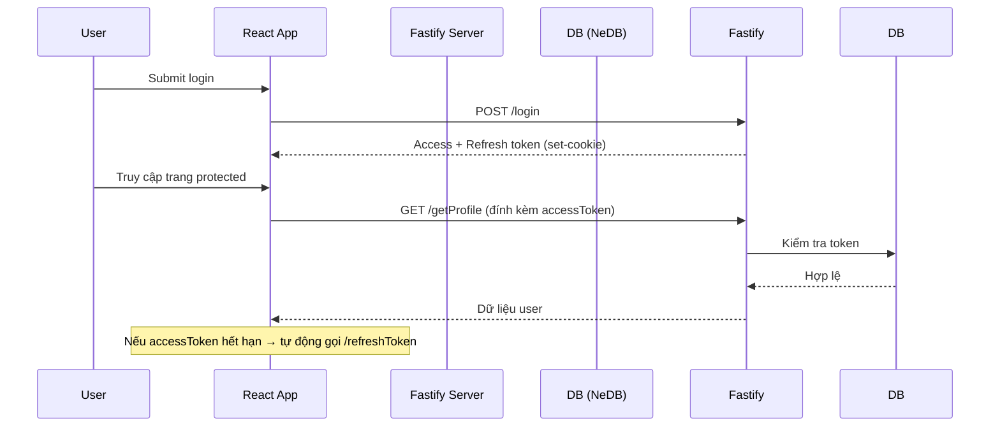

# 🔐 JWT Authentication App - React + Fastify (NeDB)

Một dự án nhỏ mô phỏng hệ thống **authentication & authorization** thực tế sử dụng:

- 🖥 **Frontend**: React + TypeScript + React Query + Zustand
- 🔧 **Backend**: Fastify + TypeScript + NeDB (giả lập database)
- 🔁 Hỗ trợ **JWT Access Token + Refresh Token** đầy đủ, tự động refresh và bảo vệ route.
- ✉️ Xác thực email, đổi email, đổi mật khẩu, quên mật khẩu...

---

## 🚀 Demo tính năng

### Client (React)

- ✅ Đăng ký / Đăng nhập
- ✅ Xác minh tài khoản qua email
- ✅ Refresh Token tự động bằng `react-query` interceptor
- ✅ Bảo vệ route bằng JWT (kể cả phân quyền `admin` / `user`)
- ✅ Đổi mật khẩu & email có xác thực lại (có modal UI đẹp)
- ✅ Quên mật khẩu + gửi lại email xác nhận
- ✅ Zustand quản lý Auth Store

### Server (Fastify)

- ✅ Fastify + TypeScript + NeDB (`nedb-promises`) để giả lập DB
- ✅ Xác thực JWT qua middleware
- ✅ Làm sạch refresh token sau khi logout
- ✅ Cấu trúc mã sạch: controller / middleware / schema / utils

---

## 🧱 Công nghệ sử dụng

### 💻 Frontend

| Tech               | Vai trò                    |
| ------------------ | -------------------------- |
| **React**          | UI chính                   |
| **TypeScript**     | Kiểm soát kiểu dữ liệu     |
| **React Query**    | Gọi API và caching tự động |
| **Zustand**        | State management cho Auth  |
| **ShadCN UI**      | Giao diện đẹp mắt          |
| **React Router**   | Quản lý route              |
| **React Toastify** | Hiển thị thông báo         |

### 🛠 Backend

| Tech                     | Vai trò                      |
| ------------------------ | ---------------------------- |
| **Fastify**              | Web server cực nhanh         |
| **TypeScript**           | Strict typing                |
| **NeDB (nedb-promises)** | Giả lập database nhỏ gọn     |
| **Zod**                  | Validate dữ liệu từ client   |
| **JWT (jsonwebtoken)**   | Quản lý token bảo mật        |
| **Custom Error Handler** | Xử lý lỗi rõ ràng cho client |

---

## 🔒 Các route trên backend

### Public

- `POST /register`
- `POST /login`
- `POST /verifyAccount`
- `POST /resend_verifyAccount`
- `POST /forgot-password`
- `POST /resend-update-password`
- `POST /update-password`
- `POST /refreshToken`
- `POST /logout`

### Protected (cần token)

- `GET /getProfile`
- `PUT /updateProfile`
- `PUT /change-password`
- `PUT /change-email`
- `POST /confirm-change-email`

---

## 🧠 Mô phỏng flow xác thực

